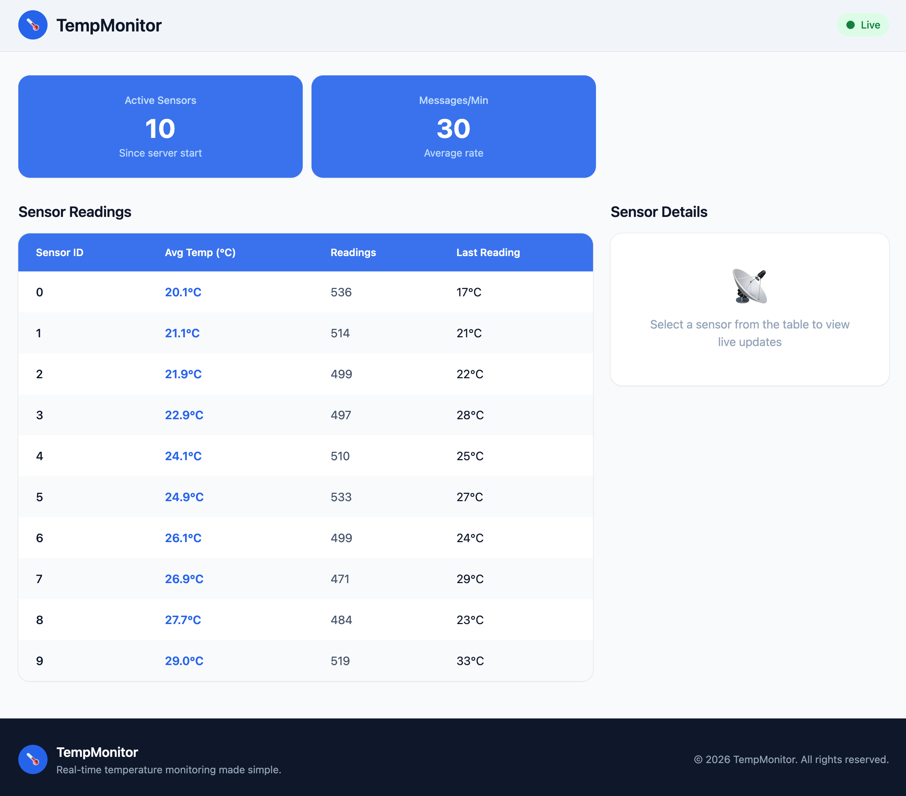
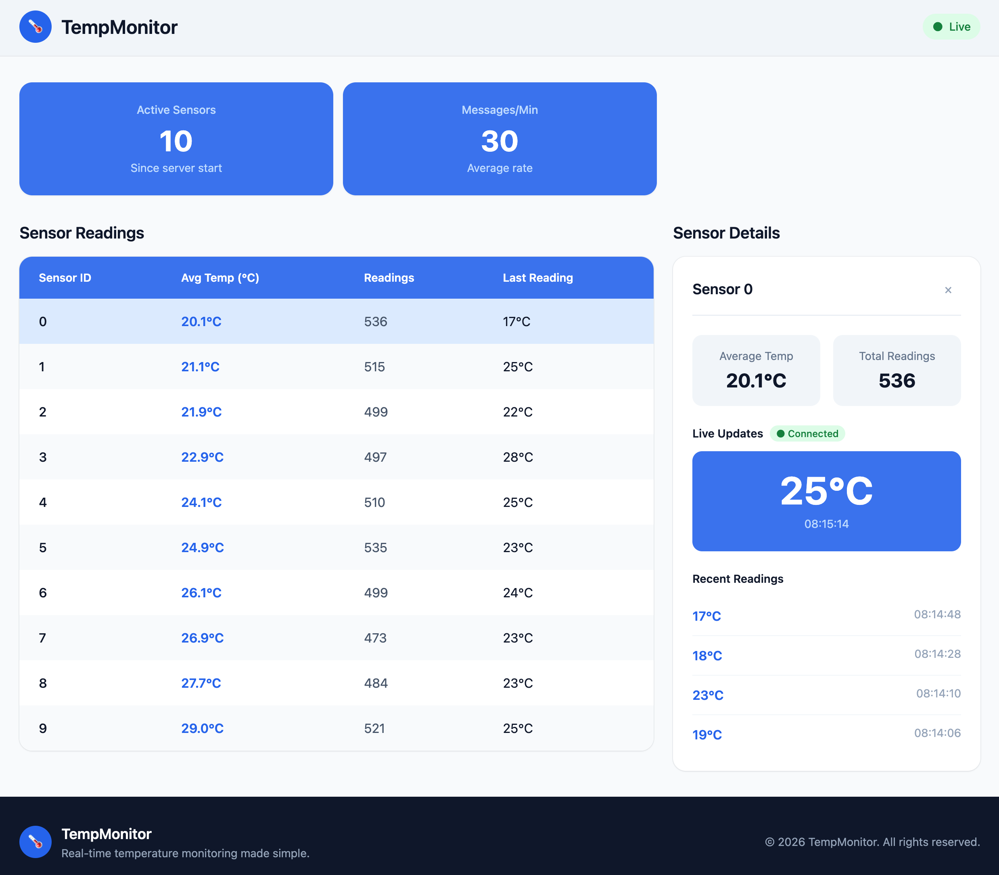

# TempMonitor

A real-time temperature monitoring system that reads binary sensor data and displays live updates through a modern web interface.

## Technologies

### Backend
- **Node.js** with TypeScript (ES2022)
- **Express.js** - REST API framework
- **ws** - WebSocket server for real-time communication
- **Jest** - Unit testing framework
- **ESLint** - Code quality

### Frontend
- **Angular 20** - Latest Angular framework
- **TypeScript** - Type-safe development
- **Angular Signals** - Reactive state management
- **RxJS** - Reactive programming
- **Tailwind CSS** - Utility-first styling
- **Karma/Jasmine** - Testing framework

## Architecture

```
┌─────────────────────────────────────────────────────────────────────┐
│                           Frontend (Angular)                         │
│  ┌─────────────┐  ┌──────────────┐  ┌─────────────┐  ┌───────────┐ │
│  │ StatsCard   │  │ SensorTable  │  │SensorDetail │  │ErrorBanner│ │
│  └─────────────┘  └──────────────┘  └─────────────┘  └───────────┘ │
│         │                │                 │                        │
│         └────────────────┼─────────────────┘                        │
│                          │                                          │
│  ┌───────────────────────┴───────────────────────┐                 │
│  │                   App Component                │                 │
│  │         (State Management via Signals)         │                 │
│  └───────────────────────┬───────────────────────┘                 │
│                          │                                          │
│         ┌────────────────┴────────────────┐                        │
│         │                                 │                        │
│  ┌──────┴──────┐                  ┌───────┴───────┐                │
│  │  API Service │                  │WebSocket Svc  │                │
│  │   (HTTP)     │                  │  (Real-time)  │                │
│  └──────┬──────┘                  └───────┬───────┘                │
└─────────┼─────────────────────────────────┼────────────────────────┘
          │                                 │
          │ REST API                        │ WebSocket
          │                                 │
┌─────────┼─────────────────────────────────┼────────────────────────┐
│         │           Backend (Node.js)     │                        │
│  ┌──────┴──────┐                  ┌───────┴───────┐                │
│  │   Express   │                  │  WS Server    │                │
│  │   Routes    │                  │  (ws library) │                │
│  └──────┬──────┘                  └───────┬───────┘                │
│         │                                 │                        │
│         └────────────────┬────────────────┘                        │
│                          │                                          │
│              ┌───────────┴───────────┐                             │
│              │  Sensor Data Service  │                             │
│              │   (In-memory store)   │                             │
│              └───────────┬───────────┘                             │
│                          │                                          │
│              ┌───────────┴───────────┐                             │
│              │    Binary Parser      │                             │
│              │  (2-byte messages)    │                             │
│              └───────────┬───────────┘                             │
│                          │                                          │
│         ┌────────────────┴────────────────┐                        │
│         │                                 │                        │
│  ┌──────┴──────┐                  ┌───────┴───────┐                │
│  │ measure_temp │                  │  Mock Process │                │
│  │  (Real HW)   │                  │ (Development) │                │
│  └─────────────┘                  └───────────────┘                │
└────────────────────────────────────────────────────────────────────┘
```

## Data Flow

### Binary Protocol

Sensor data is transmitted as 2-byte messages:

```
Byte 0: [Type (2 bits)][Sensor ID (6 bits)]
Byte 1: [Temperature (8 bits)]

Bits 0-1:  Message type (only type 2 is processed)
Bits 2-7:  Sensor ID (0-63)
Bits 8-15: Temperature in Celsius (0-255)
```

Example: `0xA2 0x19` = Type 2, Sensor 40, Temperature 25°C

### Flow Sequence

1. **Data Acquisition**: Binary data from `measure_temp` process (or mock)
2. **Parsing**: Binary parser extracts type-2 messages only
3. **Storage**: Sensor data service maintains readings (max 100 per sensor)
4. **REST API**: Clients fetch sensor summaries and statistics
5. **WebSocket**: Real-time readings broadcast to subscribed clients
6. **UI Update**: Angular signals trigger component re-renders

## Project Structure

```
temperature-monitor/
├── backend/
│   ├── src/
│   │   ├── index.ts                 # Server entry point
│   │   ├── routes/
│   │   │   └── sensor.routes.ts     # REST API endpoints
│   │   ├── services/
│   │   │   ├── binary-parser.ts     # Binary message parsing
│   │   │   ├── binary-parser.test.ts
│   │   │   └── sensor-data.service.ts
│   │   ├── websocket/
│   │   │   └── socket-handler.ts    # WebSocket server
│   │   ├── mock/
│   │   │   └── mock-temp-process.ts # Mock data generator
│   │   └── types/
│   │       └── sensor.types.ts      # TypeScript interfaces
│   ├── package.json
│   └── tsconfig.json
│
├── frontend/
│   ├── src/
│   │   ├── main.ts                  # App bootstrap
│   │   ├── app/
│   │   │   ├── app.ts               # Root component
│   │   │   ├── app.html             # Root template
│   │   │   ├── app.config.ts
│   │   │   ├── components/
│   │   │   │   ├── stats-card/      # Statistics display card
│   │   │   │   ├── sensor-table/    # Sensor list with selection
│   │   │   │   ├── sensor-detail/   # Live sensor view
│   │   │   │   └── error-banner/    # Error display
│   │   │   ├── services/
│   │   │   │   ├── sensor-api.service.ts   # HTTP client
│   │   │   │   └── websocket.service.ts    # WebSocket client
│   │   │   ├── models/
│   │   │   │   └── sensor.models.ts
│   │   │   └── environments/
│   │   │       ├── environment.ts
│   │   │       └── environment.prod.ts
│   │   └── styles.css               # Tailwind CSS
│   ├── angular.json
│   ├── tailwind.config.js
│   └── package.json
│
└── IMPLEMENTATION_PLAN.md
```

## API Endpoints

| Method | Endpoint | Description |
|--------|----------|-------------|
| GET | `/api/stats` | Active sensor count and messages/minute |
| GET | `/api/sensors` | All sensors with averages |
| GET | `/api/sensors/:id` | Specific sensor with recent readings |
| GET | `/health` | Health check endpoint |

## WebSocket Protocol

Connect to `ws://localhost:3000/ws` for real-time updates.

### Client to Server
```json
{ "type": "subscribe", "sensorId": 5 }
{ "type": "unsubscribe" }
```

### Server to Client
```json
{ "type": "reading", "sensorId": 5, "temperature": 23, "timestamp": "..." }
{ "type": "connected" }
{ "type": "subscribed", "sensorId": 5 }
{ "type": "unsubscribed" }
```

## Getting Started

### Prerequisites
- Node.js 18+
- npm

### Backend

```bash
cd backend
npm install
npm run dev    # Development with hot reload
npm run build  # Production build
npm start      # Run production build
npm test       # Run tests
```

The backend starts on http://localhost:3000

### Frontend

```bash
cd frontend
npm install
npm start      # Development server at http://localhost:4200
npm run build  # Production build
npm test       # Run tests
```

## Environment Variables

| Variable | Default | Description |
|----------|---------|-------------|
| `PORT` | 3000 | Backend server port |
| `MOCK_MODE` | true | Use mock data instead of real sensor |
| `MOCK_SENSOR_COUNT` | 10 | Number of simulated sensors |
| `MOCK_INTERVAL_MS` | 2000 | Interval between mock readings |

## Testing

Backend tests cover the binary parser with 14 test cases:
- Valid type-2 message parsing
- Invalid message type filtering
- Sensor ID extraction (0-63 range)
- Temperature value extraction
- Edge cases (empty buffers, odd-length data)

```bash
cd backend
npm test
```

## Features

- Real-time temperature monitoring from multiple sensors
- Live WebSocket updates for selected sensors
- Dashboard displaying:
  - Number of active sensors
  - Average messages per minute
  - Sensor table with average temperatures
  - Live sensor detail view
- Responsive design (mobile + desktop)
- Auto-reconnection with exponential backoff
- Error handling with user-friendly messages


## Screenshots

List of Sensors



With Sensor Details


Error Message
